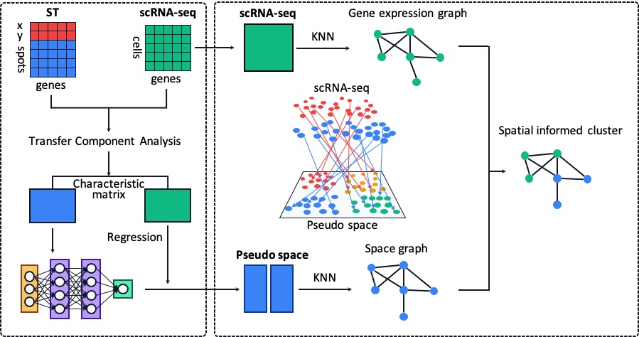

# scSpace

## Reconstruction of cell pseudo space from single-cell RNA sequencing data

[](https://www.python.org/) 

scSpace (<u>**s**</u>ingle-<u>**c**</u>ell and <u>**s**</u>patial <u>**p**</u>osition <u>**a**</u>ssociated <u>**c**</u>o-<u>**e**</u>mbeddings) is an integrative algorithm that integrates spatial transcriptome data to reconstruct spatial associations of single cells within scRNA-seq data. Using [transfer component analysis (TCA)](https://ieeexplore.ieee.org/stamp/stamp.jsp?tp=&arnumber=5640675&tag=1), scSpace could extract the characteristic matrixes of spatial transcriptomics and scRNA-seq, and project single cells into a pseudo space via a [multiple layer perceptron (MLP)](https://en.wikipedia.org/wiki/Multilayer_perceptron) model, so that gene expression and spatial graph of cells can be embedded jointly for the further cell typing with higher accuracy and precision. 



# Requirements
[](https://github.com/numpy/numpy) [](https://github.com/pandas-dev/pandas) [](https://github.com/scikit-learn/scikit-learn) [](https://github.com/scipy/scipy) [](https://github.com/pytorch/pytorch) [](https://cran.r-project.org/web/packages/optparse/index.html) [](https://cran.r-project.org/web/packages/Seurat/index.html) [](https://cran.r-project.org/web/packages/leidenAlg/index.html) [](https://cran.r-project.org/web/packages/BiocManager/index.html) [](https://bioconductor.org/packages/release/bioc/html/BiocNeighbors.html) [](https://cran.r-project.org/web/packages/igraph/index.html) 

For scSpace, the python version need is over 3.8 and the R version need is over 4.1. 
```
cd setup
pip install -r requirements.txt
Rscript requirements.R
```

# Parameters
Some important parameters in scSpace are listed bellow:

In `pre-processing` step:
- `--project`: the name of the folder where the data is stored. Make sure it's in the `data/` directory 
- `--sc_data`: the name of input scRNA-seq data
- `--sc_meta`: the name of input scRNA-seq metadata
- `--st_data`: the name of input spatial transcriptomics data
- `--st_meta`: the name of input spatial transcriptomics metadata. Make sure this file contains two columns of `xcoord` and `ycoord` 
- `--normalize`: normalize the data or not
- `--st_type`: `st` for spot-based ST data (10x Visium, Slide-seq, Slide-seq v2, etc) and `image` for imaged-based ST data (STARmap, MERFISH, seqFISH, etc)
- `--n_features`: the number of genes selected for downstream analysis

In `scSpace` step:
- `--kernel_type`: the kernel function used in transfer component analysis 
- `--dim`: the dimension of extracted characteristic representation across scRNA-seq and ST data
- `--batch_size`: the batch size for multiple layer perceptron model training
- `--lr`: the learning rate for multiple layer perceptron model training
- `--epoch_num`: the total epoch number for multiple layer perceptron model training
- `--hidden_size`: the hidden layer size for multiple layer perceptron model
- `--sub_cluster`: apply sub-clustering analysis for a specific cell type. If `FLASE` scSpace would apply clustering for all cells in scRNA-seq data
- `--idents`: the column name of the cell type in scRNA-seq metadata (only used when `--sub_cluster = TRUE`)
- `--select_celltype`: the specific cell type selected for sub-clustering analysis (only used when `--sub_cluster = TRUE`)
- `--Ks`: the number of nearest cells in space graph
- `--Kg`: the number of nearest cells in gene expression graph
- `--res`: the resolution for scSpace clustering
- `--target_num`: the target number of clusters for scSpace clustering. If `--target_num 0` scSpace would apply clustering directly with resolution provided


# Tutorials

1. [Demonstration of scSpace on simulated data](vignettes/demo_data.md)

2. [Spatial reconstruction of mouse intestine scRNA-seq data](vignettes/mouse_intestines_analysis.md)

3. [Spatial analysis of the invasion of myeloid subpopulations in Covid-19](vignettes/covid19_snalysis.md)

# About
scSpace was developed by Jie Liao and Jingyang Qian. Should you have any questions, please contact Jie Liao at liaojie@zju.edu.cn, or Jingyang Qian at qianjingyang@zju.edu.cn
