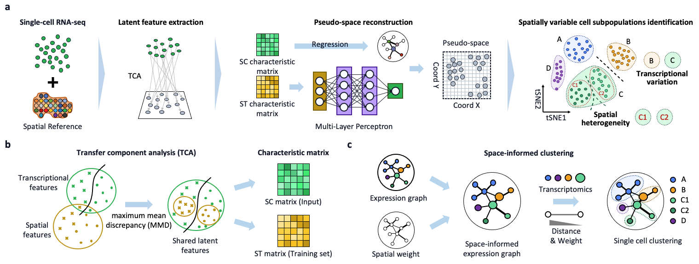

# scSpace v1.0.0

## Reconstruction of cell pseudo space from single-cell RNA sequencing data

[](https://www.python.org/) 

scSpace (<u>**s**</u>ingle-<u>**c**</u>ell and <u>**s**</u>patial <u>**p**</u>osition <u>**a**</u>ssociated <u>**c**</u>o-<u>**e**</u>mbeddings) is an integrative algorithm that integrates spatial transcriptome data to reconstruct spatial associations of single cells within scRNA-seq data. Using [transfer component analysis (TCA)](https://ieeexplore.ieee.org/stamp/stamp.jsp?tp=&arnumber=5640675&tag=1), scSpace could extract the characteristic matrixes of spatial transcriptomics and scRNA-seq, and project single cells into a pseudo space via a [multiple layer perceptron (MLP)](https://en.wikipedia.org/wiki/Multilayer_perceptron) model, so that gene expression and spatial graph of cells can be embedded jointly for the further cell typing with higher accuracy and precision. 



## Requirements and Installation
[](https://pypi.org/project/numpy/) [](https://pypi.org/project/pandas/) [](https://pypi.org/project/scikit-learn/) [](https://pypi.org/project/scipy/) [](https://github.com/scverse/scanpy) [](https://pypi.org/project/igraph/) [](https://pypi.org/project/leidenalg/) [](https://pypi.org/project/tqdm/)

### Create and activate Python environment
For scSpace, the python version need is over 3.8. If you have installed Python3.6 or Python3.7, consider installing Anaconda, and then you can create a new environment.
```
conda create -n scspace python=3.8
conda activate scspace
```
### Install pytorch
The version of pytorch should be suitable to the CUDA version of your machine. You can find the appropriate version on the [PyTorch website](https://pytorch.org/get-started/locally/).
Here is an example with CUDA11.6:
```
pip install torch --extra-index-url https://download.pytorch.org/whl/cu116
```
### Install other requirements
```
cd scSpace-master
pip install -r requirements.txt
```
### Install scSpace
```
python setup.py build
python setup.py install
```

## Quick Start
To use scSpace we require five formatted `.csv` files as input (i.e. read in by pandas). We have included a toy dataset 
in the [vignettes/data folder](vignettes/data) of this repository as examples to show how to use scSpace:
* [Demonstration of scSpace on demo dataset]()


## Tutorials

1. [Demonstration of scSpace on simulated data](vignettes/demo_data.md)

2. [Spatial reconstruction of mouse intestine scRNA-seq data](vignettes/mouse_intestines_analysis.md)

3. [Spatial analysis of the invasion of myeloid subpopulations in Covid-19](vignettes/covid19_snalysis.md)

## About
scSpace was developed by Jie Liao and Jingyang Qian. Should you have any questions, please contact Jie Liao at liaojie@zju.edu.cn, or Jingyang Qian at qianjingyang@zju.edu.cn
