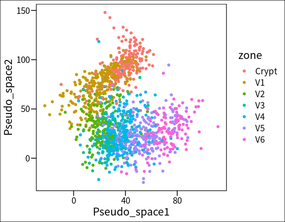
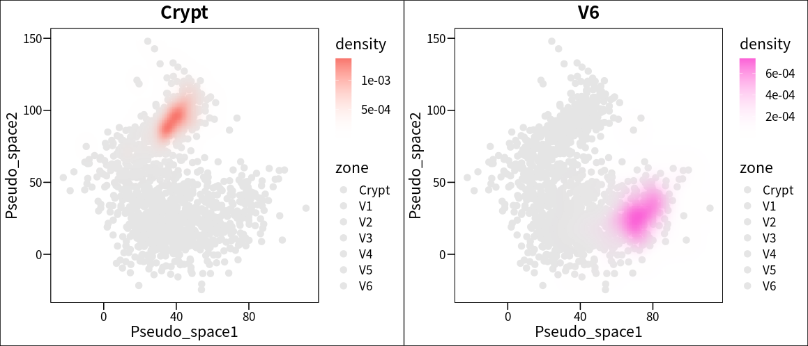
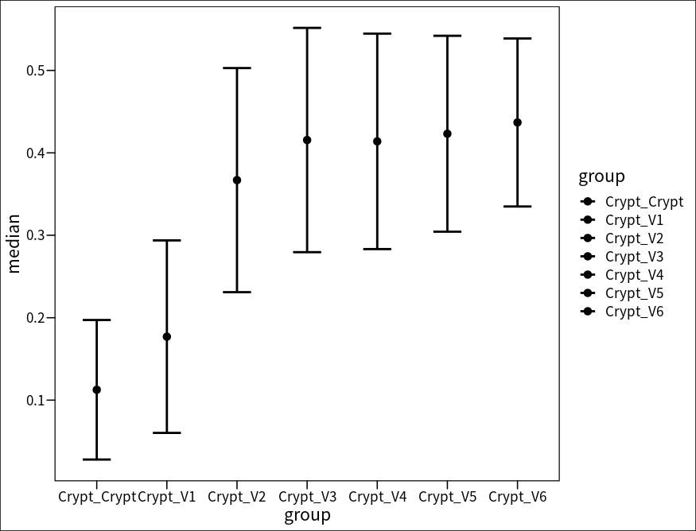

# Spatial reconstruction of mouse intestine scRNA-seq data using scSpace

Jingyang Qian  
2022-04-15

In this vignette, we will show you an application of scSpace to perform regional reconstruction of mouse intestine 
scRNA-seq data.

The mouse intestine [scRNA-seq](https://pubmed.ncbi.nlm.nih.gov/30270040/) data by Moor et.al. and the 
[spatial reference](https://pubmed.ncbi.nlm.nih.gov/35149721/) by Parigi et.al. can be downloaded from
[here](https://github.com/FowardYang/scSpace_develop).

```
# data pre process
Rscript preprocess.R --project mouse_intestine --sc_data sc_data --sc_meta sc_meta --st_data st_data --st_meta st_meta --normalize TRUE --n_features 2000

[comment]: <> (=== Data Pre-processing ===)
[comment]: <> (Loading data...)
[comment]: <> (Data have been loaded...)
[comment]: <> (There are 26599 common genes in scRNA-seq and spatial transcriptomics data...)
[comment]: <> (Normalizing the data...)
[comment]: <> (Data have been normalized...)
[comment]: <> (Select 2000 features as top variable features...)
[comment]: <> (Data have been pre-processed, begin saving...)
[comment]: <> (Pre-processed have been done!)

# scSpace
python main.py --project_name mouse_intestine --dim 50 --batch_size 16 --lr 0.001 --epoch_num 1000 --sample_mlp --hidden_size 128

[comment]: <> (*************** scSpace *****************)
[comment]: <> (Loading processed data......)
[comment]: <> (Load data ok)
[comment]: <> (=== Transfer Component Analysis ===)
[comment]: <> (Transfer Component Analysis done.)
[comment]: <> (=== Training encoder for source domain ===)
[comment]: <> (Epoch [100/1000]: Batch loss=236.30758666992188)
[comment]: <> (Epoch [200/1000]: Batch loss=218.34909057617188)
[comment]: <> (Epoch [300/1000]: Batch loss=201.19094848632812)
[comment]: <> (Epoch [400/1000]: Batch loss=185.78378295898438)
[comment]: <> (Epoch [500/1000]: Batch loss=170.65504455566406)
[comment]: <> (Epoch [600/1000]: Batch loss=157.68153381347656)
[comment]: <> (Epoch [700/1000]: Batch loss=147.52435302734375)
[comment]: <> (Epoch [800/1000]: Batch loss=139.908935546875)
[comment]: <> (Epoch [900/1000]: Batch loss=133.37255859375)
[comment]: <> (Epoch [1000/1000]: Batch loss=127.41557312011719)

*************** scSpace *****************
Loading processed data......
Load data ok
=== Transfer Component Analysis ===
Transfer Component Analysis done.
=== Training encoder for source domain ===
Epoch [100/1000]: Batch loss=253.62864685058594
Epoch [200/1000]: Batch loss=240.24256896972656
Epoch [300/1000]: Batch loss=235.2732696533203
Epoch [400/1000]: Batch loss=229.68228149414062
Epoch [500/1000]: Batch loss=223.92889404296875
Epoch [600/1000]: Batch loss=218.04544067382812
Epoch [700/1000]: Batch loss=211.4386444091797
Epoch [800/1000]: Batch loss=202.83926391601562
Epoch [900/1000]: Batch loss=193.0808563232422
Epoch [1000/1000]: Batch loss=183.89584350585938
```

The spatial reconstruction result is stored at __`data/intestines/Processed_data`__.

We can see the regional structure of mouse intestine is reconstructed well in pseudo space.
```
source('analysis_function.R')

pseudo_space <- read.csv('./data/mouse_intestine/processed_data/pseudo_space.csv', row.names = 1)
scspace_meta <-  read.csv('./data/mouse_intestine/sc_meta.csv', row.names = 1)
scspace_meta$Pseudo_space1 <- pseudo_space$X0
scspace_meta$Pseudo_space2 <- pseudo_space$X1

# pseudo space
plot_pseudo_space(scspace_meta = scspace_meta, group_by = 'zone')
```


The position of each region in pseudo space is showed:
```
# Crypt
p1 <- plot_density(scspace_meta = scspace_meta,
                   group_by = 'zone',
                   selected_type = 'Crypt',
                   color_high = '#F8766D')
# V6
p2 <- plot_density(scspace_meta = scspace_meta,
                   group_by = 'zone',
                   selected_type = 'V6',
                   color_high = '#FB61D7')
plot_grid(p1, p2)
```


And we further calculated the normalized distance from each region to `Crypt`, the result showed that the normalized 
distance between each region and `Crypt` region increases with the trend from `Crypt` region to `V6` region:
:
```
# calculate normalized distance from each region to Crypt
normalized_dist <- calculate_dist(scspace_meta = scspace_meta, 
                                  group_by = 'zone',
                                  selected_type = 'Crypt')

# plot                                  
plot_dist(dist_obj = normalized_dist)                                 
```

