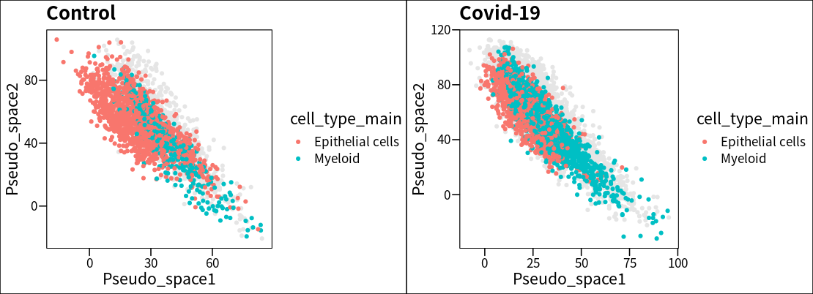
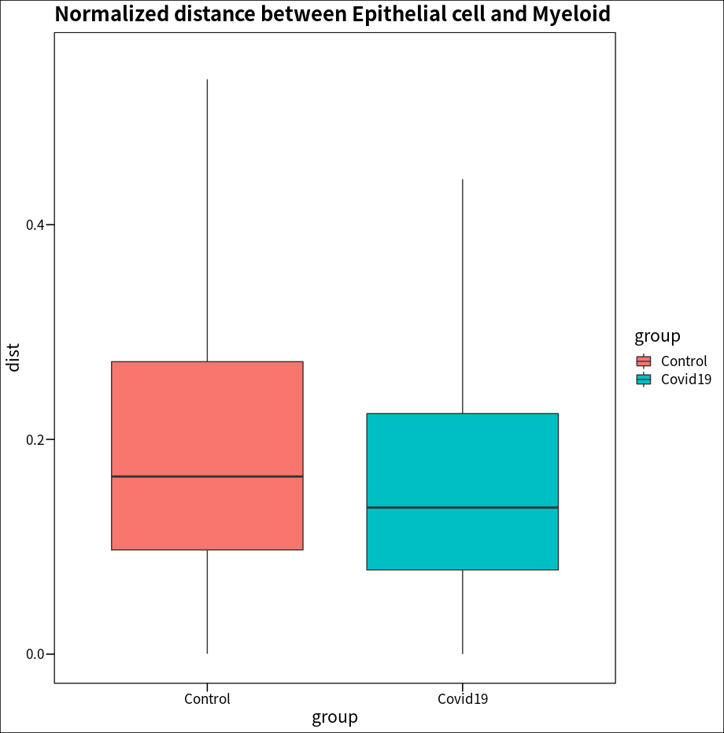
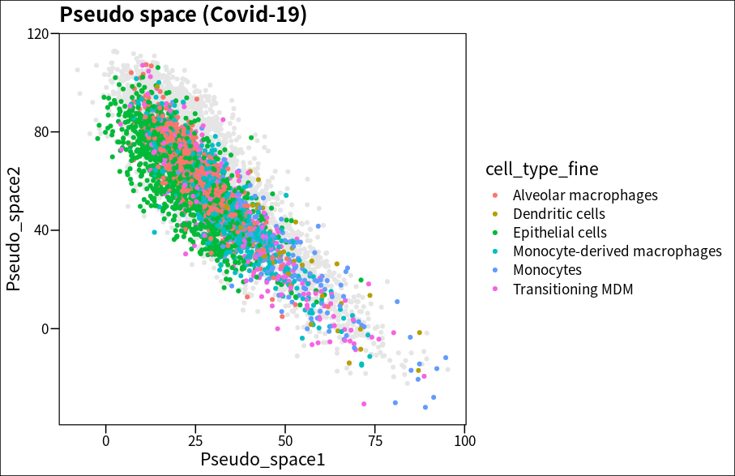
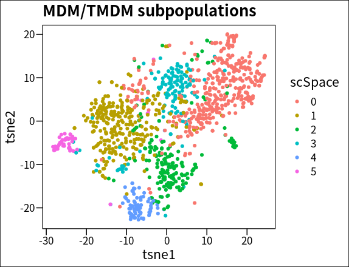
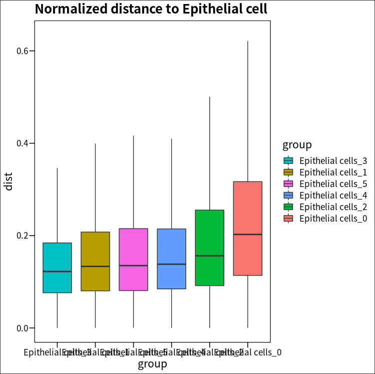
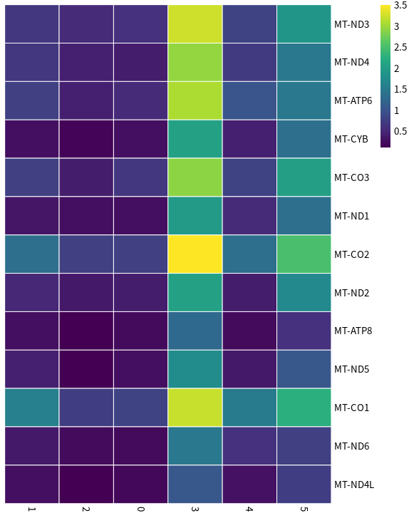

# Spatial analysis of the invasion of myeloid subpopulations in Covid-19 using scSpace

Jingyang Qian  
2022-04-15

In this vignette, we will show you an application of scSpace to find invasive myeloid subpopulations in Covid-19 
scRNA-seq data.

The [molecular single-cell lung atlas](https://pubmed.ncbi.nlm.nih.gov/33915568/) of lethal COVID-19 by Melms et.al. and the 
[human lung spatial reference](https://www.ncbi.nlm.nih.gov/geo/query/acc.cgi?acc=GSE178361) by Lakshminarasimha et.al. can be downloaded from
[here](https://github.com/FowardYang/scSpace_develop).

```
# data pre process
Rscript preprocess.R --project covid19 --sc_data sc_data --sc_meta sc_meta --st_data st_data --st_meta st_meta --normalize TRUE --n_features 2000

[comment]: <> (=== Data Pre-processing ===)
[comment]: <> (Loading data...)
[comment]: <> (Data have been loaded...)
[comment]: <> (There are 34545 common genes in scRNA-seq and spatial transcriptomics data...)
[comment]: <> (Normalizing the data...)
[comment]: <> (Data have been normalized...)
[comment]: <> (Select 2000 features as top variable features...)
[comment]: <> (Data have been pre-processed, begin saving...)
[comment]: <> (Pre-processed have been done!)

# scSpace
python main.py --project_name covid19 --dim 50 --batch_size 16 --lr 0.001 --epoch_num 800 --sample_mlp --hidden_size 128

[comment]: <> (*************** scSpace *****************)
[comment]: <> (Loading processed data......)
[comment]: <> (Load data ok)
[comment]: <> (=== Transfer Component Analysis ===)
[comment]: <> (Transfer Component Analysis done.)
[comment]: <> (=== Training encoder for source domain ===)
[comment]: <> (Epoch [100/800]: Batch loss=149.51300048828125)
[comment]: <> (Epoch [200/800]: Batch loss=126.6762924194336)
[comment]: <> (Epoch [300/800]: Batch loss=112.64030456542969)
[comment]: <> (Epoch [400/800]: Batch loss=104.3958511352539)
[comment]: <> (Epoch [500/800]: Batch loss=96.08672332763672)
[comment]: <> (Epoch [600/800]: Batch loss=89.7009506225586)
[comment]: <> (Epoch [700/800]: Batch loss=83.0310287475586)
[comment]: <> (Epoch [800/800]: Batch loss=77.57140350341797)
```

The spatial reconstruction result is stored at __`data/covid19/Processed_data`__.

We can firstly investigate the invasion of myeloid cells in control and Covid-19 group:
```
source('analysis_function.R')

pseudo_space <- read.csv('./data/covid19/processed_data/pseudo_space.csv', row.names = 1)
scspace_meta <-  read.csv('./data/covid19/sc_meta.csv', row.names = 1)
scspace_meta$Pseudo_space1 <- pseudo_space$X0
scspace_meta$Pseudo_space2 <- pseudo_space$X1

p1 <- plot_pseudo_space(scspace_meta = scspace_meta[scspace_meta$group == 'Control', ], 
                        group_by = 'cell_type_main',
                        show_ct = c('Epithelial cells', 'Myeloid')) +
  ggtitle('Control')
p2 <- plot_pseudo_space(scspace_meta = scspace_meta[scspace_meta$group == 'COVID-19', ], 
                        group_by = 'cell_type_main',
                        show_ct = c('Epithelial cells', 'Myeloid')) +
  ggtitle('Covid-19')

plot_grid(p1, p2)
```


Compared with the Control group, the normalized distance between myeloid cells and epithelial cells in pseudo space was 
significantly reduced in the Covid-19 group, suggesting a severe infiltration response.

```
scspace_meta_new <- scspace_meta[scspace_meta$cell_type_main == 'Epithelial cells' |
                                   scspace_meta$cell_type_main == 'Myeloid', ]

covid19_dist <- calculate_dist(scspace_meta = scspace_meta_new[scspace_meta_new$group == 'COVID-19', ],
                               group_by = 'cell_type_main',
                               selected_type = 'Epithelial cells',
                               ignore_select_type = TRUE)

control_dist <- calculate_dist(scspace_meta = scspace_meta_new[scspace_meta_new$group == 'Control', ],
                               group_by = 'cell_type_main',
                               selected_type = 'Epithelial cells',
                               ignore_select_type = TRUE)

covid19_dist$group <- 'Covid19'
control_dist$group <- 'Control'
all_dist <- rbind(covid19_dist, control_dist)

ggplot(data=all_dist, aes(x=group, y=dist, fill=group)) +
  geom_boxplot(outlier.shape = NA) +
  coord_cartesian(ylim = boxplot.stats(all_dist$dist)$stats[c(1, 5)]*1.2) + 
  theme_base() + 
  ggtitle('Normalized distance between Epithelial cell and Myeloid')
```


```
# Wilcoxon Rank Sum and Signed Rank Tests
wilcox.test(covid19_dist$dist, control_dist$dist)
```
```
	Wilcoxon rank sum test with continuity correction

data:  covid19_dist$dist and control_dist$dist
W = 6.2495e+11, p-value < 2.2e-16
alternative hypothesis: true location shift is not equal to 0
```

Now focusing further on the myeloid cell subpopulations, we found that `Monocyte-derived macrophages (MDM)`
and `Transitioning MDM (TMDM)` in the Covid-19 group showed a significant trend of infiltration into Epithelial cells in 
pseudo space compared to the Control group 

```
scspace_meta[scspace_meta$cell_type_main == 'Epithelial cells', ]$cell_type_fine <- 'Epithelial cells'
plot_pseudo_space(scspace_meta = scspace_meta[scspace_meta$group == 'COVID-19', ], 
                        group_by = 'cell_type_fine',
                        show_ct = c('Epithelial cells', 'Alveolar macrophages', 'Dendritic cells',
                                    'Monocyte-derived macrophages', 'Monocytes', 'Transitioning MDM')) +
  ggtitle('Pseudo space (Covid-19)')
```


```
scspace_meta_new[scspace_meta_new$cell_type_main == 'Epithelial cells', ]$cell_type_fine <- 'Epithelial cells'

covid19_dist <- calculate_dist(scspace_meta = scspace_meta_new[scspace_meta_new$group == 'COVID-19', ],
                               group_by = 'cell_type_fine',
                               selected_type = 'Epithelial cells')

control_dist <- calculate_dist(scspace_meta = scspace_meta_new[scspace_meta_new$group == 'Control', ],
                               group_by = 'cell_type_fine',
                               selected_type = 'Epithelial cells')
covid19_dist <- covid19_dist[covid19_dist$group != 'Epithelial cells_Epithelial cells', ]
control_dist <- control_dist[control_dist$group != 'Epithelial cells_Epithelial cells', ]
covid19_dist$group2 <- 'Covid19'
control_dist$group2 <- 'Control'
all_dist <- rbind(covid19_dist, control_dist)

ggplot(data=all_dist, aes(x=group, y=dist, fill=group2)) +
  geom_boxplot(outlier.shape = NA) +
  coord_cartesian(ylim = boxplot.stats(all_dist$dist)$stats[c(1, 5)]*1.5) + 
  ggtitle('Normalized distance between Epithelial cell and Myeloid subtype') +
  theme_base()
```


We then clustered MDM and TMDM into 6 subpopulations using scSpace:

```
Rscript scspace_cluster.R --project covid19 --sc_data sc_data --sc_meta sc_meta --sub_cluster TRUE --idents cell_type --select_celltype MDM_TMDM --normalize FALSE --Ks 40 --Kg 20 --target_num 6

[comment]: <> (=== scSpace clustering ===)
[comment]: <> (Loading data...)
[comment]: <> (Data have been loaded...)
[comment]: <> (Spatial-informed sub-clustering of MDM_TMDM...)
[comment]: <> (Data processing...)
[comment]: <> (Begin spatial-informed clustering...)
[comment]: <> (Unsupervised clustering with target cluster num = 6, sarching appropriate res firstly...)
[comment]: <> (Start at res = 0.5, step = 0.1)
[comment]: <> (Res = 0.5, number of clusters = 3)
[comment]: <> (Res = 0.6, number of clusters = 6)
[comment]: <> (Recommended res = 0.6)
[comment]: <> (Begin saving data...)
[comment]: <> (Saving data OK!)

# mdm clustering
mdm_meta <- read.csv('./data/covid19/output_data/output_sc_meta.csv', row.names = 1)
plot_tsne(scspace_meta = mdm_meta, group_by = 'scSpace') +
  ggtitle('MDM/TMDM subpopulations')
```


We further calculated the normalized distance from each MDM/TMDM subpopulation to epithelial cells, and found that a 
subpopulation that overexpressed a large number of mitochondria-related genes (C3) showed very close distance to epithelial 
cells in pseudo space, which may play an important role in the progression of Covid-19.
```
scspace_meta <- read.csv('./data/demo/output_data/output_sc_meta.csv', row.names = 1)

# pseudo space
ggplot(scspace_meta) +
  geom_point(aes(Pseudo_space1, Pseudo_space2, color = Group)) +
  theme_base()
```


```
mdm_data <- read.csv('./data/covid19/output_data/output_sc_data.csv', row.names = 1)
mdm_meta <- read.csv('./data/covid19/output_data/output_sc_meta.csv', row.names = 1)
mdm_seu <- CreateSeuratObject(mdm_data, meta.data = mdm_meta)

mt_gene <- c('MT-ND3', 'MT-ND4', 'MT-ATP6', 'MT-CYB', 'MT-CO3', 'MT-ND1', 'MT-CO2', 'MT-ND2', 
             'MT-ATP8', 'MT-ND5', 'MT-CO1', 'MT-ND6', 'MT-ND4L')
Idents(mdm_seu) <- 'scSpace'
gene_to_heatmap <- AverageExpression(mdm_seu, slot = 'count', features = mt_gene)$RNA
pheatmap(gene_to_heatmap, 
         cluster_rows = FALSE, 
         cluster_cols = FALSE,
         border_color = 'white',
         color = colorRampPalette(viridis(9))(100))
```


