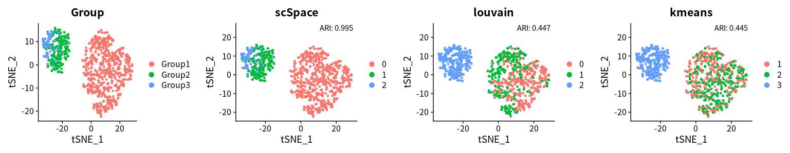
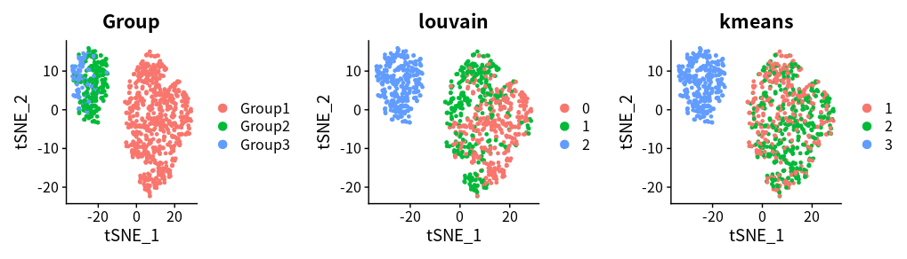
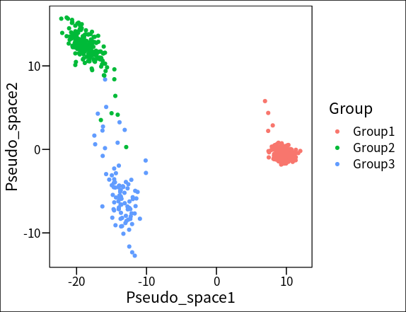
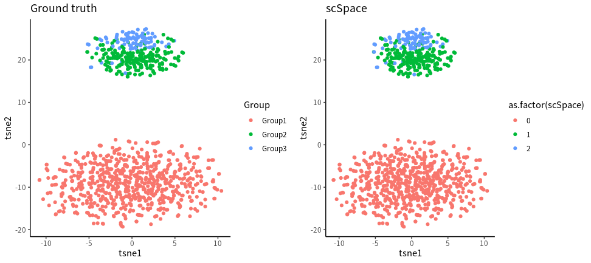

# scSpace for simulated data

Jingyang Qian  
2022-04-14

In this vignette, we will show you the example of scSpace using simulated data.



We applied [Splatter](https://pubmed.ncbi.nlm.nih.gov/28899397/) R package (v1.16.1) to construct a set of paired 
scRNA-seq and spatial transcriptomics data. The data could be accessed from [data/demo/](../scSpace/data/demo) or [here](https://github.com/FowardYang/scSpace_develop).

This simulated scRNA-seq data contain totally 3 cell clusters, however, 2 of them are spatially heterogeneous cell 
subpopulations with similar transcriptome characteristics. We can perform classical Louvain or K-means clustering on this scRNA-seq data firstly.

This step runs in Rstudio (R 4.1.1), and the __`analysis_function.R`__ can be accessed [here](https://github.com/FowardYang/scSpace_develop).
```
source('analysis_function.R')

# load data
sc_data <- read.csv('./data/demo/demo_sc_data.csv', row.names = 1)
sc_meta <- read.csv('./data/demo/demo_sc_meta.csv', row.names = 1)

# data process
sc_seu <- data_process(sc_data = sc_data, sc_meta = sc_meta)

# louvain
sc_seu <- get_louvain_clu(sc_seu = sc_seu, res = 0.8)

# k-means
sc_seu <- get_kmeans_clu(sc_seu = sc_seu, target_num = 3)

# plot
p1 <- DimPlot(sc_seu, reduction = 'tsne', group.by = 'Group')
p2 <- DimPlot(sc_seu, reduction = 'tsne', group.by = 'louvain')
p3 <- DimPlot(sc_seu, reduction = 'tsne', group.by = 'kmeans')
plot_grid(p1, p2, p3, ncol = 3)
```


The results showed that neither Louvain nor K-means could distinguish these two spatially heterogeneous subpopulations.

Now let's apply scSpace:

```
# data pre process
Rscript preprocess.R --project demo --normalize TRUE --n_features 2000

[comment]: <> (=== Data Pre-processing ===)
[comment]: <> (Loading data...)
[comment]: <> (Data have been loaded...)
[comment]: <> (There are 5000 common genes in scRNA-seq and spatial transcriptomics data...)
[comment]: <> (Normalizing the data...)
[comment]: <> (Data have been normalized...)
[comment]: <> (Select 2000 features as top variable features...)
[comment]: <> (Data have been pre-processed, begin saving...)
[comment]: <> (Pre-processed have been done!)

# scSpace
python main.py --project_name demo --dim 50 --batch_size 16 --lr 0.001 --epoch_num 1000 --hidden_size 128

[comment]: <> (*************** scSpace *****************)
[comment]: <> (Loading processed data......)
[comment]: <> (Load data ok)
[comment]: <> (=== Transfer Component Analysis ===)
[comment]: <> (Transfer Component Analysis done.)
[comment]: <> (=== Training encoder for source domain ===)
[comment]: <> (Epoch [100/1000]: Batch loss=5.823261260986328)
[comment]: <> (Epoch [200/1000]: Batch loss=4.019391059875488)
[comment]: <> (Epoch [300/1000]: Batch loss=3.3907828330993652)
[comment]: <> (Epoch [400/1000]: Batch loss=2.964690923690796)
[comment]: <> (Epoch [500/1000]: Batch loss=2.3209750652313232)
[comment]: <> (Epoch [600/1000]: Batch loss=1.875225305557251)
[comment]: <> (Epoch [700/1000]: Batch loss=1.6312471628189087)
[comment]: <> (Epoch [800/1000]: Batch loss=1.4563220739364624)
[comment]: <> (Epoch [900/1000]: Batch loss=1.3233532905578613)
[comment]: <> (Epoch [1000/1000]: Batch loss=1.1936973333358765)

Rscript scspace_cluster.R --project demo --target_num 3

[comment]: <> (=== scSpace clustering ===)
[comment]: <> (Loading data...)
[comment]: <> (Data have been loaded...)
[comment]: <> (Data processing...)
[comment]: <> (Begin spatial-informed clustering...)
[comment]: <> (Unsupervised clustering with target cluster num = 3, sarching appropriate res firstly...)
[comment]: <> (Start at res = 0.5, step = 0.1)
[comment]: <> (Res = 0.5, number of clusters = 2)
[comment]: <> (Res = 0.6, number of clusters = 2)
[comment]: <> (Res changed to 0.6)
[comment]: <> (Res = 0.7, number of clusters = 3)
[comment]: <> (Recommended res = 0.7)
[comment]: <> (Begin saving data...)
[comment]: <> (Saving data OK!)
```

We can access the output data at __`data/demo/output_data`__

The scSpace result showed that these two spatially heterogeneous cell subpopulations (Group2, Group3) separate well in pseudo space.
```
scspace_meta <- read.csv('./data/demo/output_data/output_sc_meta.csv', row.names = 1)

# pseudo space
plot_pseudo_space(scspace_meta = scspace_meta, group_by = 'Group')
```


And the unsupervised clustering result also fit well with ground truth. 

```
p1 <- plot_tsne(scspace_meta = scspace_meta, group_by = 'Group')
p2 <- plot_tsne(scspace_meta = scspace_meta, group_by = 'scSpace')
plot_grid(p1, p2)
```


